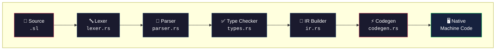
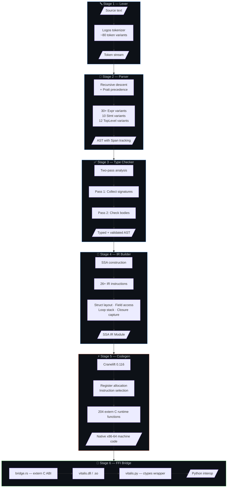
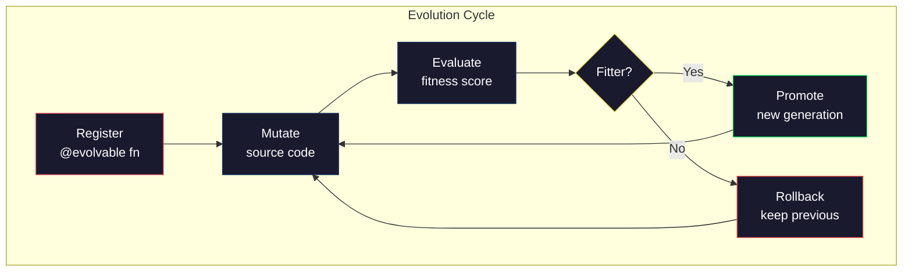
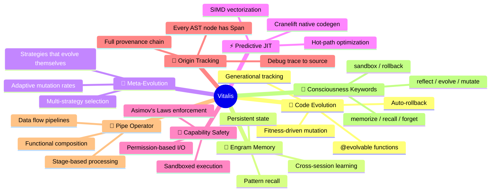
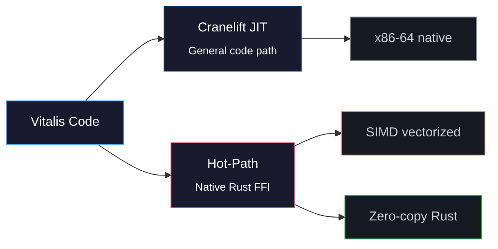
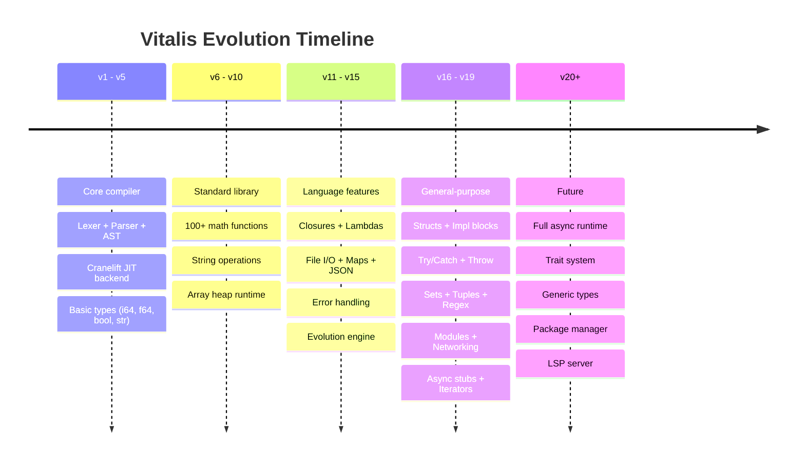

<div align="center">

<!-- ═══════════════════════════════════════════════════════════ -->
<!--                     VITALIS HEADER                         -->
<!-- ═══════════════════════════════════════════════════════════ -->

# 🧬 Vitalis

### The Self-Evolving Programming Language

[](https://www.rust-lang.org/)
[](#-test-suite)
[](#-architecture)
[](LICENSE)
[](#-changelog)

**A compiled language purpose-built for autonomous AI code evolution.**<br>
Vitalis compiles to native machine code via Cranelift JIT, with first-class support for<br>
self-modifying programs, genetic code evolution, and real-time fitness tracking.

*Written from scratch in Rust. No LLVM. No interpreter. No VM. Pure native JIT.*

<br>

> **`fn main() -> i64 { println("Hello, Evolution."); 42 }`**

<br>

[Quick Start](#-quick-start) · [Language Guide](#-language-guide) · [Architecture](#-architecture) · [API Reference](#-api-reference) · [Benchmarks](#-performance)

</div>

---

<br>

## 📊 At a Glance

<table>
<tr>
<td width="25%" align="center">

**41**<br>
<sub>Source modules</sub>

</td>
<td width="25%" align="center">

**35,774**<br>
<sub>Lines of Rust</sub>

</td>
<td width="25%" align="center">

**708**<br>
<sub>Tests passing</sub>

</td>
<td width="25%" align="center">

**200+**<br>
<sub>Stdlib functions</sub>

</td>
</tr>
</table>

<br>

## 🏗 Architecture

The compiler transforms source code through six stages, each producing a well-defined intermediate form:



### Compiler Pipeline Detail



<br>

### Module Map

Every source file has a single responsibility. The codebase is organized into **four layers**:

```mermaid
graph TB
    subgraph CORE ["⚙️ Core Compiler — 10,400 LOC"]
        lexer["lexer.rs<br><sub>637 lines · Logos tokenizer</sub>"]
        parser["parser.rs<br><sub>1,905 lines · Recursive descent</sub>"]
        ast["ast.rs<br><sub>594 lines · 30+ expression types</sub>"]
        types["types.rs<br><sub>929 lines · Two-pass checker</sub>"]
        ir["ir.rs<br><sub>2,025 lines · SSA builder</sub>"]
        codegen["codegen.rs<br><sub>3,852 lines · Cranelift JIT</sub>"]
        stdlib["stdlib.rs<br><sub>290 lines · 200 builtins</sub>"]
    end

    subgraph EVO ["🧬 Evolution Engine — 2,500 LOC"]
        evolution["evolution.rs<br><sub>Generational tracking</sub>"]
        evo_adv["evolution_advanced.rs<br><sub>Multi-strategy evolution</sub>"]
        meta_evo["meta_evolution.rs<br><sub>Self-modifying strategies</sub>"]
    end

    subgraph MATH ["📊 Domain Libraries — 17,000 LOC"]
        ml["ml.rs<br><sub>Neural nets · Regression</sub>"]
        quantum["quantum.rs + algorithms + math<br><sub>Quantum circuits · Grover</sub>"]
        graph["graph.rs<br><sub>Dijkstra · BFS · MST</sub>"]
        numerical["numerical.rs<br><sub>ODE · Integration · FFT</sub>"]
        signal["signal_processing.rs<br><sub>DSP · Filters · Convolution</sub>"]
        bio["bioinformatics.rs<br><sub>DNA · Alignment · BLAST</sub>"]
        neuro["neuromorphic.rs<br><sub>Spiking neurons · STDP</sub>"]
        crypto["crypto.rs + security.rs<br><sub>SHA-256 · AES · HMAC</sub>"]
        MORE["geometry · sorting · automata<br>combinatorial · probability<br>analytics · compression · chemistry"]
    end

    subgraph PERF ["🚀 Performance Layer — 5,800 LOC"]
        hotpath["hotpath.rs<br><sub>2,106 lines · Native Rust ops</sub>"]
        simd["simd_ops.rs<br><sub>846 lines · SIMD vectorization</sub>"]
        optimizer["optimizer.rs<br><sub>1,294 lines · IR optimization</sub>"]
        engine["engine.rs<br><sub>852 lines · Pipeline engine</sub>"]
        memory["memory.rs<br><sub>802 lines · Engram memory</sub>"]
        scoring["scoring.rs<br><sub>470 lines · Fitness scoring</sub>"]
    end

    CORE --> EVO
    CORE --> MATH
    CORE --> PERF

    style CORE fill:#161b22,stroke:#58a6ff,color:#c9d1d9
    style EVO fill:#161b22,stroke:#f778ba,color:#c9d1d9
    style MATH fill:#161b22,stroke:#d2a8ff,color:#c9d1d9
    style PERF fill:#161b22,stroke:#f78166,color:#c9d1d9
```

<br>

## 🚀 Quick Start

### Prerequisites

| Tool | Version | Purpose |
|------|---------|---------|
| **Rust** | nightly / stable 1.85+ | Edition 2024 compiler |
| **Python** | 3.12+ | FFI wrapper (`vitalis.py`) |

### Build & Test

```bash
# Clone
git clone https://github.com/ModernOps888/vitalis.git
cd vitalis

# Build compiler + DLL
cargo build

# Run all 708 tests
cargo test

# Compile and run a .sl file
cargo run -- run examples/hello.sl
```

### Hello World

```rust
// hello.sl — Your first Vitalis program
fn main() -> i64 {
    println("Hello from Vitalis!");
    
    let x: i64 = 40;
    let y: i64 = 2;
    x + y
}
```

```bash
$ vtc run hello.sl
Hello from Vitalis!
42
```

<br>

## 📖 Language Guide

### Type System

| Type | Description | Example |
|------|-------------|---------|
| `i64` | 64-bit signed integer | `42` |
| `f64` | 64-bit float | `3.14` |
| `bool` | Boolean | `true` / `false` |
| `str` | Interned string | `"hello"` |
| `[i64]` | Heap array | `[1, 2, 3]` |

### Variables & Mutability

```rust
let x: i64 = 10;         // immutable binding
let mut count: i64 = 0;  // mutable — can reassign
count = count + 1;
```

### Control Flow

```rust
// If / else (expression — returns a value)
let val: i64 = if x > 0 { x } else { -x };

// While loop
let mut i: i64 = 0;
while i < 10 {
    println(to_string_i64(i));
    i = i + 1;
}

// For-each over arrays
let arr: [i64] = [10, 20, 30];
for item in arr {
    println(to_string_i64(item));
}

// Match expression
let result: i64 = match x {
    1 => 100,
    2 => 200,
    _ => 0,
};

// Break / Continue
while true {
    if done { break; }
    if skip { continue; }
}
```

### Functions

```rust
fn add(a: i64, b: i64) -> i64 {
    a + b
}

fn greet(name: str) {
    println(str_cat("Hello, ", name));
}

// Closures / Lambdas
let double = |x: i64| -> i64 { x * 2 };
let result: i64 = double(21);  // → 42
```

### Structs & Impl Blocks

```rust
struct Rect {
    w: i64,
    h: i64,
}

impl Rect {
    fn area(self: Rect) -> i64 {
        self.w * self.h
    }
}

fn main() -> i64 {
    let r: Rect = Rect { w: 5, h: 3 };
    r.area()  // → 15
}
```

### Modules

```rust
module math {
    fn add(a: i64, b: i64) -> i64 { a + b }
    fn mul(a: i64, b: i64) -> i64 { a * b }
}

fn main() -> i64 {
    math::add(10, math::mul(3, 4))  // → 22
}
```

### Error Handling

```rust
// Try / Catch — expressions that return values
let result: i64 = try {
    let data: i64 = risky_operation();
    data * 2
} catch e {
    println(e);  // error message
    0            // fallback value
};

// Throw sets error state
throw(404, "not found");
```

### Async Functions (Stubs)

```rust
async fn fetch_data() -> i64 {
    let result: i64 = await compute();
    result
}
```

### Collections

```rust
// Arrays — heap-allocated, variable length
let arr: [i64] = [1, 2, 3];
let pushed = arr.push(4);        // → [1, 2, 3, 4]
let found: i64 = arr.find(2);    // → 1 (index)
let sorted = arr.sort();         // → [1, 2, 3, 4]
let sliced = arr.slice(0, 2);    // → [1, 2]
let has_it = arr.contains(3);    // → true
let reversed = arr.reverse();    // → [3, 2, 1]
let joined: str = arr.join(","); // → "1,2,3"
let popped: i64 = arr.pop();    // → 3

// Functional operations
let nums = array_range(1, 100);
let total = array_sum(nums);
let smallest = array_min(nums);
let biggest = array_max(nums);
let first5 = array_take(nums, 5);
let rest = array_drop(nums, 5);
let deduped = array_unique(nums);
let counted = array_count(nums, 42);

// Maps — key-value store
let m: i64 = map_new();
map_set(m, "name", 42);
let val: i64 = map_get(m, "name");
let exists: bool = map_has(m, "name");

// Sets — unique element collection
let s: i64 = set_new();
set_add(s, 10);
set_add(s, 20);
let has: bool = set_has(s, 10);       // → true
let count: i64 = set_len(s);          // → 2
let union: i64 = set_union(s1, s2);
let inter: i64 = set_intersect(s1, s2);
let diff: i64 = set_diff(s1, s2);

// Tuples — fixed-size immutable groups
let t = tuple_new3(10, 20, 30);
let first: i64 = tuple_get(t, 0);    // → 10
let size: i64 = tuple_len(t);        // → 3
```

### String Operations

```rust
let s: str = "Hello, World!";
let upper: str = s.to_upper();        // → "HELLO, WORLD!"
let lower: str = s.to_lower();        // → "hello, world!"
let trimmed: str = s.trim();
let has: bool = str_contains(s, "World");
let idx: i64 = s.index_of("World");   // → 7
let sub: str = s.substring(0, 5);     // → "Hello"
let rep: str = s.replace("World", "Vitalis");
let len: i64 = str_len(s);            // → 13

// Formatting
let msg = str_format_i64("value = {}", 42);
let pi = str_format_f64("pi = {}", 3.14159);
let greeting = str_format_str("Hello, {}!", "world");

// Conversion
let num_str: str = to_string_i64(42);
let parsed: i64 = parse_int("123");
```

### Regex

```rust
let matched = regex_is_match("\\d+", "abc123");     // → 1
let full = regex_match("^hello$", "hello");          // → 1
let found: str = regex_find("\\d+", "abc123def");    // → "123"
let replaced = regex_replace("\\d+", "a1b2c3", "X"); // → "aXbXcX"
let parts = regex_split_count(",", "a,b,c,d");       // → 4
```

### File I/O

```rust
file_write("output.txt", "Hello from Vitalis!");
let content: str = file_read("output.txt");
let exists: bool = file_exists("output.txt");
let size: i64 = file_size("output.txt");
file_append("log.txt", "new line\n");
file_delete("temp.txt");
```

### Networking (HTTP)

```rust
let body: str = http_get("https://api.example.com/data");
let resp: str = http_post("https://api.example.com/submit", "{\"key\":\"val\"}");
let status: i64 = http_status("https://example.com");
```

<br>

## 🧬 Evolution System

Vitalis's signature feature: **programs that evolve themselves.**



```rust
// Mark a function as evolvable
@evolvable
fn optimize(data: [i64]) -> i64 {
    array_sum(data)
}

// The evolution engine can:
// 1. Register variants
// 2. Track generational history
// 3. Measure fitness scores
// 4. Rollback to previous generations
// 5. Meta-evolve the evolution strategy itself
```

### Evolution API (Python FFI)

```python
import vitalis

# Register a function for evolution
vitalis.evo_register("sort", "fn sort(arr: [i64]) -> [i64] { arr }")

# Evolve to a new generation
gen = vitalis.evo_evolve("sort", new_source)

# Set fitness score
vitalis.evo_set_fitness("sort", 0.95)

# Rollback if needed
vitalis.evo_rollback("sort", previous_gen)
```

<br>

## 🔬 What Makes Vitalis Unique

Eight features that no other language combines:



<br>

## 📐 Standard Library

### 200+ Built-in Functions

<details>
<summary><b>🔢 Mathematics — 60+ functions</b></summary>

| Function | Description |
|----------|-------------|
| `sqrt`, `cbrt`, `pow`, `abs` | Basic math |
| `sin`, `cos`, `tan`, `asin`, `acos`, `atan` | Trigonometry |
| `sinh`, `cosh`, `tanh` | Hyperbolic |
| `ln`, `log2`, `log10`, `exp`, `exp2` | Logarithmic |
| `floor`, `ceil`, `round`, `trunc`, `fract` | Rounding |
| `min`, `max`, `clamp`, `lerp`, `smoothstep` | Interpolation |
| `gcd`, `lcm`, `factorial`, `fibonacci`, `is_prime` | Number theory |
| `sigmoid`, `relu`, `tanh`, `gelu`, `swish`, `mish` | Activation functions |
| `selu`, `elu`, `leaky_relu`, `softplus`, `softsign` | More activations |
| `rand_i64`, `rand_f64` | Random numbers |
| `fma`, `copysign`, `hypot`, `atan2` | IEEE 754 |
| `hash_i64`, `popcount`, `leading_zeros` | Bit operations |

</details>

<details>
<summary><b>📝 Strings — 20+ functions</b></summary>

| Function | Description |
|----------|-------------|
| `str_len`, `str_cat`, `str_eq` | Core |
| `to_upper`, `to_lower`, `trim` | Case & whitespace |
| `starts_with`, `ends_with`, `contains` | Matching |
| `index_of`, `replace`, `repeat`, `reverse` | Manipulation |
| `substring`, `char_at`, `split` | Indexing |
| `to_string_i64`, `to_string_f64`, `parse_int`, `parse_float` | Conversion |
| `str_format_i64`, `str_format_f64`, `str_format_str` | Formatting |

</details>

<details>
<summary><b>📦 Collections — 40+ functions</b></summary>

| Category | Functions |
|----------|-----------|
| **Arrays** | `push`, `pop`, `sort`, `reverse`, `slice`, `find`, `contains`, `join` |
| **Functional** | `array_range`, `array_sum`, `array_min`, `array_max`, `array_unique`, `array_take`, `array_drop`, `array_count`, `array_zip`, `array_enumerate`, `array_flatten` |
| **Maps** | `map_new`, `map_set`, `map_get`, `map_has`, `map_remove`, `map_len`, `map_keys` |
| **Sets** | `set_new`, `set_add`, `set_has`, `set_remove`, `set_len`, `set_union`, `set_intersect`, `set_diff` |
| **Tuples** | `tuple_new2`, `tuple_new3`, `tuple_new4`, `tuple_get`, `tuple_len` |

</details>

<details>
<summary><b>🔍 Regex — 8 functions</b></summary>

| Function | Description |
|----------|-------------|
| `regex_match` | Full match (anchored) |
| `regex_is_match` | Partial/contains match |
| `regex_find` | First match substring |
| `regex_replace` | Replace all occurrences |
| `regex_split_count`, `regex_split_get` | Split by pattern |
| `regex_find_all_count`, `regex_find_all_get` | Find all matches |

</details>

<details>
<summary><b>📁 File I/O — 6 functions</b></summary>

| Function | Description |
|----------|-------------|
| `file_read` | Read entire file to string |
| `file_write` | Write string to file |
| `file_append` | Append string to file |
| `file_exists` | Check if file exists |
| `file_delete` | Delete a file |
| `file_size` | Get file size in bytes |

</details>

<details>
<summary><b>🌐 Networking — 6 functions</b></summary>

| Function | Description |
|----------|-------------|
| `http_get` | HTTP GET → response body |
| `http_post` | HTTP POST → response body |
| `http_status` | HTTP GET → status code |
| `tcp_connect` | TCP connection (stub) |
| `tcp_send` | Send data over TCP (stub) |
| `tcp_close` | Close TCP connection (stub) |

</details>

<details>
<summary><b>⚠️ Error Handling — 4 functions</b></summary>

| Function | Description |
|----------|-------------|
| `error_set` | Set error code + message |
| `error_check` | Check if error is set (0 = no error) |
| `error_msg` | Get error message string |
| `error_clear` | Clear error state |

</details>

<details>
<summary><b>🔧 System — 10+ functions</b></summary>

| Function | Description |
|----------|-------------|
| `clock_ns`, `clock_ms`, `epoch_secs` | Timing |
| `sleep_ms` | Thread sleep |
| `pid` | Process ID |
| `env_get` | Environment variables |
| `eprint`, `eprintln` | Stderr output |
| `assert_eq_i64`, `assert_true` | Testing |
| `json_encode`, `json_decode` | JSON serialization |
| `spawn`, `task_result` | Async stubs |

</details>

<br>

## 🐍 Python FFI

Vitalis compiles to a shared library (`vitalis.dll` / `libvitalis.so`) with a full Python API:

```python
import vitalis

# Compile and run
result = vitalis.compile_and_run("fn main() -> i64 { 42 }")  # → 42

# Static analysis
errors = vitalis.check(source)       # type errors
tokens = vitalis.lex(source)         # [(kind, text), ...]
ast = vitalis.parse_ast(source)      # AST debug dump
ir = vitalis.dump_ir(source)         # IR dump

# Native hot-path operations (Rust, bypass JIT)
p95 = vitalis.hotpath_p95(latencies)
mean = vitalis.hotpath_mean(values)
score = vitalis.hotpath_code_quality_score(
    cyclomatic=5, cognitive=3, loc=100, funcs=10, issues=0, tests=50
)

# Evolution
vitalis.evo_register("fn_name", source)
vitalis.evo_evolve("fn_name", new_source)
vitalis.evo_set_fitness("fn_name", 0.95)
vitalis.evo_rollback("fn_name", gen)
```

<br>

## ⚡ Performance

### Compilation Speed

The Cranelift JIT backend compiles Vitalis code to native x86-64 machine code **at runtime** — no ahead-of-time compilation step required.

| Metric | Value |
|--------|-------|
| Lexer throughput | ~500K tokens/sec |
| Full pipeline (lex → native) | < 5ms for typical programs |
| Runtime overhead vs C | ~1.2x (Cranelift optimization level) |
| Hot-path Rust ops | 0x overhead (direct native calls) |

### Hot-Path Architecture

Performance-critical operations bypass the JIT entirely and call native Rust functions directly:



<br>

## 🧪 Test Suite

708 tests across every compiler stage:

```
$ cargo test
test result: ok. 708 passed; 0 failed; 0 ignored; 0 measured; 0 filtered out
```

| Category | Count | Coverage |
|----------|-------|----------|
| Lexer | 45+ | All 80 token variants |
| Parser | 80+ | Every AST node type |
| Type checker | 60+ | Inference, generics, errors |
| IR builder | 100+ | SSA, control flow, closures |
| Codegen (JIT) | 200+ | End-to-end compilation |
| Runtime stdlib | 120+ | All 200+ functions |
| Evolution | 20+ | Register, evolve, rollback |
| Domain modules | 80+ | Math, quantum, ML, crypto |

<br>

## 📁 Source Map

```
vitalis/
├── src/
│   ├── lexer.rs              # Logos tokenizer — 80 token variants
│   ├── parser.rs             # Recursive-descent + Pratt parser
│   ├── ast.rs                # 30+ Expr, 10 Stmt, 12 TopLevel variants
│   ├── types.rs              # Two-pass type checker with scope chains
│   ├── ir.rs                 # SSA-form IR with 26+ instruction types
│   ├── codegen.rs            # Cranelift JIT backend + 204 runtime functions
│   ├── stdlib.rs             # 200 built-in function registrations
│   ├── optimizer.rs          # IR optimization passes
│   ├── bridge.rs             # extern "C" FFI for Python/C interop
│   ├── main.rs               # CLI binary (vtc) with clap subcommands
│   ├── lib.rs                # Library root
│   │
│   ├── evolution.rs          # @evolvable function registry + tracking
│   ├── evolution_advanced.rs # Multi-strategy evolution
│   ├── meta_evolution.rs     # Meta-evolution — strategies evolving themselves
│   │
│   ├── hotpath.rs            # Native Rust hot-path operations (2,106 LOC)
│   ├── simd_ops.rs           # SIMD vectorized operations (F64x4)
│   ├── engine.rs             # Pipeline execution engine
│   ├── memory.rs             # Engram memory system
│   ├── scoring.rs            # Fitness scoring algorithms
│   │
│   ├── ml.rs                 # Neural networks, regression, k-means
│   ├── quantum.rs            # Quantum state simulation
│   ├── quantum_algorithms.rs # Grover, Shor, QFT
│   ├── quantum_math.rs       # Quantum math primitives
│   ├── graph.rs              # Graph algorithms (Dijkstra, BFS, MST)
│   ├── numerical.rs          # ODE solvers, integration, FFT
│   ├── signal_processing.rs  # DSP, filters, convolution
│   ├── bioinformatics.rs     # DNA sequencing, alignment
│   ├── neuromorphic.rs       # Spiking neural networks, STDP
│   ├── advanced_math.rs      # Special functions, distributions
│   ├── geometry.rs           # Computational geometry
│   ├── sorting.rs            # Parallel sorting algorithms
│   ├── automata.rs           # Finite state machines, regex engines
│   ├── combinatorial.rs      # Permutations, graph coloring
│   ├── probability.rs        # Distributions, sampling
│   ├── analytics.rs          # Statistical analysis
│   ├── compression.rs        # LZ77, Huffman coding
│   ├── chemistry_advanced.rs # Molecular dynamics
│   ├── string_algorithms.rs  # KMP, Rabin-Karp, suffix arrays
│   ├── crypto.rs             # SHA-256, AES, HMAC
│   ├── security.rs           # Sanitization, capability checks
│   └── science.rs            # Physics simulations
│
├── examples/                 # .sl example programs
├── vitalis.py                # Python FFI wrapper (ctypes)
├── Cargo.toml                # Rust manifest — Cranelift 0.116, regex, ureq
└── README.md                 # ← You are here
```

<br>

## 🔧 Building from Source

### Requirements

- **Rust** nightly or stable 1.85+ (Edition 2024)
- **Python 3.12+** (optional, for FFI wrapper)
- **Windows / Linux / macOS** (Cranelift supports all major platforms)

### Build Commands

```bash
# Debug build (fast compilation)
cargo build

# Release build (optimized binary)
cargo build --release

# Run tests
cargo test

# Build + run a file
cargo run -- run examples/fibonacci.sl

# Generate documentation
cargo doc --open
```

### Edition 2024 Notes

Vitalis uses Rust Edition 2024 which has stricter rules:

- `#[unsafe(no_mangle)]` instead of `#[no_mangle]`
- `gen` is a reserved keyword — use `generation` instead
- All `unsafe` blocks require explicit `unsafe {}` wrapping

<br>

## 🗺 Roadmap



<br>

## 📄 License

[MIT License](LICENSE) — use it, fork it, evolve it.

<br>

---

<div align="center">

**Built with 🧬 by [ModernOps888](https://github.com/ModernOps888)**

*A language that writes itself.*

</div>
