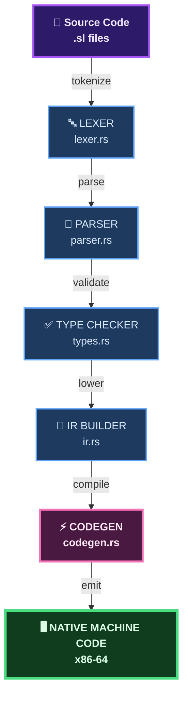
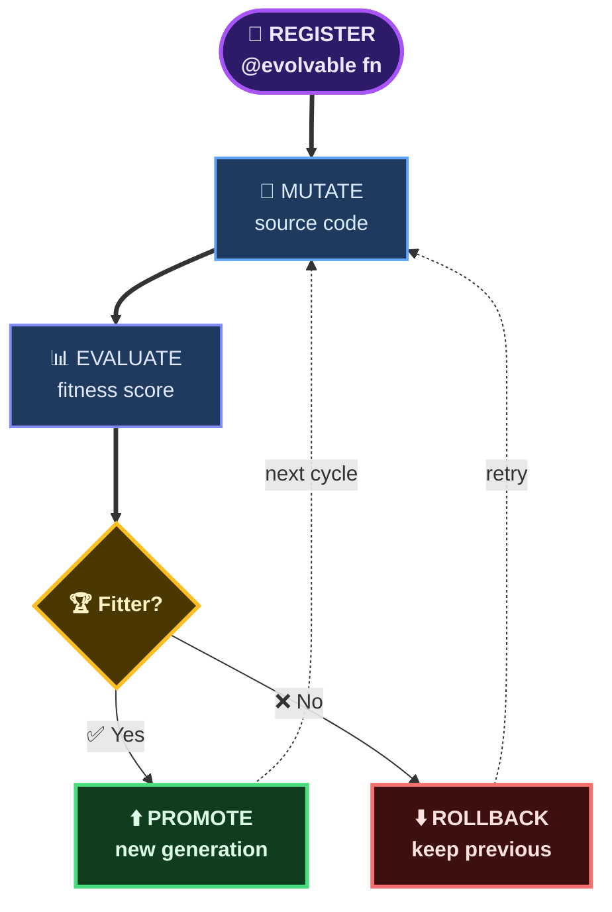
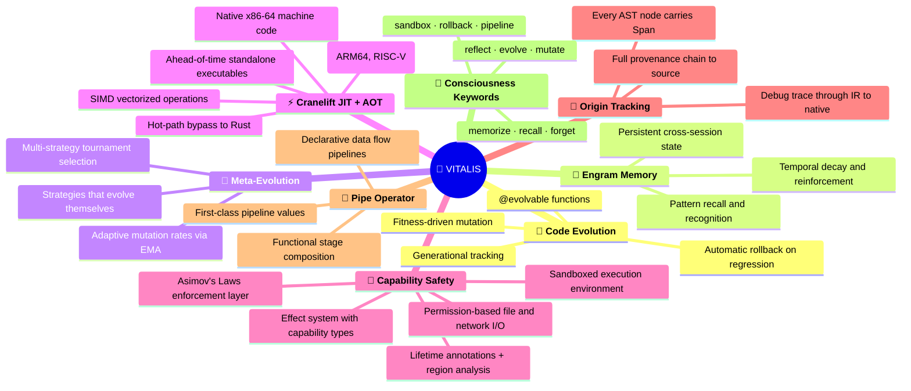
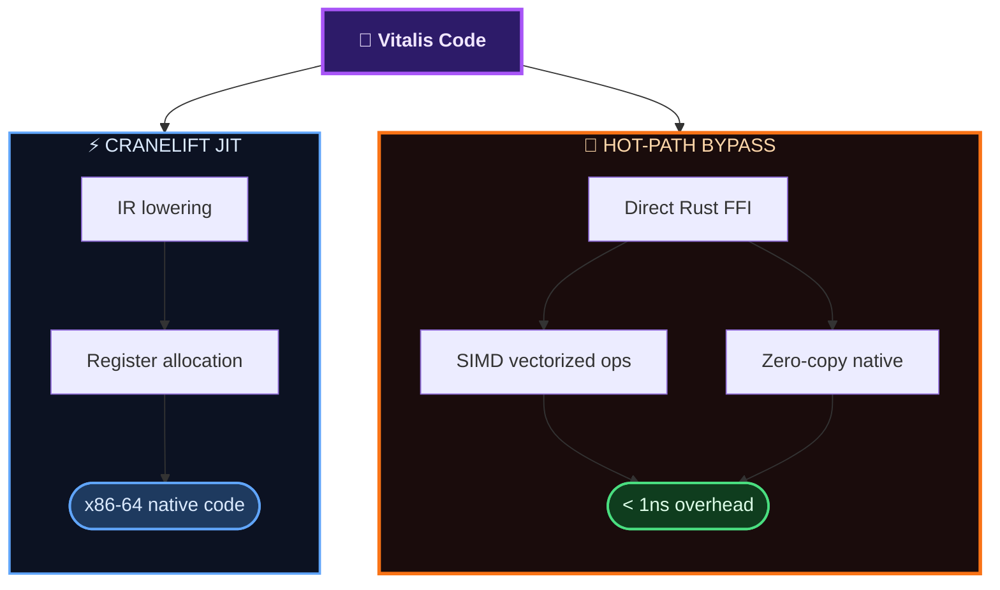

<div align="center">

<!-- ═══════════════════════════════════════════════════════════ -->
<!--                     VITALIS HEADER                         -->
<!-- ═══════════════════════════════════════════════════════════ -->

# 🧬 Vitalis

### The Self-Evolving Programming Language

[](https://www.rust-lang.org/)
[](#-test-suite)
[](#-architecture)
[](LICENSE)
[](#-changelog)

**A compiled language purpose-built for autonomous AI code evolution.**<br>
Vitalis compiles to native machine code via Cranelift JIT and AOT, with first-class support for<br>
self-modifying programs, genetic code evolution, and real-time fitness tracking.

*Written from scratch in Rust. No LLVM. No interpreter. No VM. JIT + AOT native compilation.*

<br>

> **`fn main() -> i64 { println("Hello, Evolution."); 42 }`**

<br>

[Quick Start](#-quick-start) · [Language Guide](#-language-guide) · [Architecture](#-architecture) · [API Reference](#-api-reference) · [Benchmarks](#-performance)

</div>

---

<br>

## 📊 At a Glance

<table>
<tr>
<td width="25%" align="center">

**117**<br>
<sub>Source modules</sub>

</td>
<td width="25%" align="center">

**110,000+**<br>
<sub>Lines of Rust</sub>

</td>
<td width="25%" align="center">

**2,627**<br>
<sub>Tests passing</sub>

</td>
<td width="25%" align="center">

**412+**<br>
<sub>Stdlib functions</sub>

</td>
</tr>
</table>

<br>

## 🏗 Architecture

The compiler transforms source code through six stages, each producing a well-defined intermediate form:



### Compiler Pipeline Detail

```mermaid
flowchart TB
    subgraph LEX ["🔤 STAGE 1 · LEXER"]
        direction TB
        L1(["📄 Source text"]) --> L2["Logos zero-copy tokenizer\n~80 token variants"]
        L2 --> L3(["Token stream"])
    end

    subgraph PARSE ["🌳 STAGE 2 · PARSER"]
        direction TB
        P1["Recursive descent + Pratt precedence"] --> P2["30+ Expr · 10 Stmt · 12 TopLevel"]
        P2 --> P3(["AST with Span tracking"])
    end

    subgraph TYPE ["✅ STAGE 3 · TYPE CHECKER"]
        direction TB
        T1["Pass 1 → Collect all signatures"] --> T2["Pass 2 → Check all bodies"]
        T2 --> T3(["Fully typed + validated AST"])
    end

    subgraph IR ["📐 STAGE 4 · IR BUILDER"]
        direction TB
        I1["SSA construction · 26+ instructions"] --> I2["Struct layout · Closures · Loops"]
        I2 --> I3(["SSA IR Module"])
    end

    subgraph CG ["⚡ STAGE 5 · CODEGEN"]
        direction TB
        C1["Cranelift 0.116 JIT"] --> C2["Register alloc · Instruction select"]
        C2 --> C3["204 extern C runtime functions"]
        C3 --> C4(["Native x86-64 machine code"])
    end

    subgraph FFI ["🐍 STAGE 6 · FFI BRIDGE"]
        direction TB
        F1["bridge.rs · extern C ABI"] --> F2["vitalis.dll / libvitalis.so"]
        F2 --> F3["vitalis.py · ctypes"]
        F3 --> F4(["Python interop"])
    end

    LEX ==> PARSE
    PARSE ==> TYPE
    TYPE ==> IR
    IR ==> CG
    CG ==> FFI

    style LEX fill:#0c1222,stroke:#38bdf8,stroke-width:2px,color:#e0f2fe
    style PARSE fill:#0c1222,stroke:#818cf8,stroke-width:2px,color:#e0e7ff
    style TYPE fill:#0c1222,stroke:#a78bfa,stroke-width:2px,color:#ede9fe
    style IR fill:#0c1222,stroke:#c084fc,stroke-width:2px,color:#f3e8ff
    style CG fill:#1a0c0c,stroke:#fb923c,stroke-width:3px,color:#fff7ed
    style FFI fill:#0c1a0c,stroke:#4ade80,stroke-width:3px,color:#dcfce7
```



<br>

### Module Map — 117 Modules

Every source file has a single responsibility. The codebase is organized into **ten layers**:

<table>
<tr><td colspan="4" align="center"><h4>⚙️ Core Compiler Pipeline</h4></td></tr>
<tr>
<td><code>lexer.rs</code><br><sub>Logos tokenizer</sub></td>
<td><code>parser.rs</code><br><sub>Recursive-descent + Pratt</sub></td>
<td><code>ast.rs</code><br><sub>30+ Expr, 12 TopLevel</sub></td>
<td><code>types.rs</code><br><sub>Two-pass type checker</sub></td>
</tr>
<tr>
<td><code>ir.rs</code><br><sub>SSA-form IR builder</sub></td>
<td><code>codegen.rs</code><br><sub>Cranelift JIT backend</sub></td>
<td><code>optimizer.rs</code><br><sub>IR optimization passes</sub></td>
<td><code>stdlib.rs</code><br><sub>412+ built-in functions</sub></td>
</tr>
<tr>
<td><code>bridge.rs</code><br><sub>C FFI for Python</sub></td>
<td><code>main.rs</code><br><sub>CLI binary (vtc)</sub></td>
<td><code>lib.rs</code><br><sub>Module root</sub></td>
<td></td>
</tr>
</table>

<table>
<tr><td colspan="4" align="center"><h4>🛡️ Type System & Safety</h4></td></tr>
<tr>
<td><code>generics.rs</code><br><sub>Monomorphization</sub></td>
<td><code>type_inference.rs</code><br><sub>Hindley-Milner</sub></td>
<td><code>ownership.rs</code><br><sub>Borrow checker</sub></td>
<td><code>lifetimes.rs</code><br><sub>Region analysis</sub></td>
</tr>
<tr>
<td><code>nll.rs</code><br><sub>Non-lexical lifetimes</sub></td>
<td><code>effects.rs</code><br><sub>Capability types</sub></td>
<td><code>effect_handlers.rs</code><br><sub>Algebraic effects</sub></td>
<td><code>refinement_types.rs</code><br><sub>Dependent types</sub></td>
</tr>
<tr>
<td><code>trait_dispatch.rs</code><br><sub>VTables + resolution</sub></td>
<td><code>type_classes.rs</code><br><sub>HKTs, GADTs</sub></td>
<td><code>pattern_exhaustiveness.rs</code><br><sub>Maranget algorithm</sub></td>
<td><code>formal_verification.rs</code><br><sub>Contracts, proofs</sub></td>
</tr>
</table>

<table>
<tr><td colspan="4" align="center"><h4>🎯 Compilation Targets</h4></td></tr>
<tr>
<td><code>aot.rs</code><br><sub>AOT native binaries</sub></td>
<td><code>cross_compile.rs</code><br><sub>ARM64 · RISC-V</sub></td>
<td><code>wasm_target.rs</code><br><sub>WASM module builder</sub></td>
<td><code>wasm_aot.rs</code><br><sub>WASM AOT + WASI</sub></td>
</tr>
<tr>
<td><code>bootstrap.rs</code><br><sub>Self-hosted Stage 0/1/2</sub></td>
<td><code>distributed_build.rs</code><br><sub>Distributed compilation</sub></td>
<td></td>
<td></td>
</tr>
</table>

<table>
<tr><td colspan="4" align="center"><h4>🧬 Evolution & Self-Improvement</h4></td></tr>
<tr>
<td><code>evolution.rs</code><br><sub>@evolvable registry</sub></td>
<td><code>evolution_advanced.rs</code><br><sub>DE, PSO, CMA-ES</sub></td>
<td><code>meta_evolution.rs</code><br><sub>Thompson sampling</sub></td>
<td><code>engine.rs</code><br><sub>Evolution brain</sub></td>
</tr>
<tr>
<td><code>autonomous_agent.rs</code><br><sub>Self-rewriting code</sub></td>
<td><code>reward_model.rs</code><br><sub>Learned fitness</sub></td>
<td><code>self_optimizer.rs</code><br><sub>ML-driven compiler</sub></td>
<td><code>code_intelligence.rs</code><br><sub>Code embeddings</sub></td>
</tr>
<tr>
<td><code>program_synthesis.rs</code><br><sub>Type-guided synthesis</sub></td>
<td><code>scoring.rs</code><br><sub>Fitness scoring</sub></td>
<td><code>memory.rs</code><br><sub>Engram storage</sub></td>
<td></td>
</tr>
</table>

<table>
<tr><td colspan="4" align="center"><h4>🚀 Performance & Runtime</h4></td></tr>
<tr>
<td><code>hotpath.rs</code><br><sub>44 native Rust ops</sub></td>
<td><code>simd_ops.rs</code><br><sub>AVX2 vectorization</sub></td>
<td><code>async_runtime.rs</code><br><sub>Async executor</sub></td>
<td><code>concurrency.rs</code><br><sub>Mutex, channels, Select</sub></td>
</tr>
<tr>
<td><code>memory_pool.rs</code><br><sub>Arena, slab, buddy</sub></td>
<td><code>profiler.rs</code><br><sub>Flame graphs, PGO</sub></td>
<td><code>benchmark.rs</code><br><sub>Micro-benchmarks</sub></td>
<td><code>gpu_compute.rs</code><br><sub>Compute shaders</sub></td>
</tr>
</table>

<table>
<tr><td colspan="4" align="center"><h4>🧠 AI & Machine Learning</h4></td></tr>
<tr>
<td><code>tensor.rs</code><br><sub>N-dim tensors</sub></td>
<td><code>autograd.rs</code><br><sub>Reverse-mode AD</sub></td>
<td><code>neural_net.rs</code><br><sub>Layers + training</sub></td>
<td><code>transformer.rs</code><br><sub>MHA, GQA, RoPE</sub></td>
</tr>
<tr>
<td><code>training_engine.rs</code><br><sub>Adam, LR schedules</sub></td>
<td><code>inference.rs</code><br><sub>KV cache, sampling</sub></td>
<td><code>tokenizer_engine.rs</code><br><sub>BPE, WordPiece</sub></td>
<td><code>model_adaptation.rs</code><br><sub>LoRA, QLoRA</sub></td>
</tr>
<tr>
<td><code>quantization.rs</code><br><sub>INT8/INT4, GPTQ</sub></td>
<td><code>differentiable.rs</code><br><sub>@differentiable</sub></td>
<td><code>probabilistic.rs</code><br><sub>Bayesian, MCMC</sub></td>
<td><code>ml.rs</code><br><sub>k-means, KNN, PCA</sub></td>
</tr>
<tr>
<td><code>nas.rs</code><br><sub>Architecture search</sub></td>
<td><code>continual_learning.rs</code><br><sub>EWC, progressive</sub></td>
<td><code>federated_learning.rs</code><br><sub>FedAvg, privacy</sub></td>
<td><code>rl_framework.rs</code><br><sub>DQN, PPO, A2C</sub></td>
</tr>
<tr>
<td><code>simulation.rs</code><br><sub>RL environments</sub></td>
<td><code>data_pipeline.rs</code><br><sub>DataLoader, transforms</sub></td>
<td><code>experiment.rs</code><br><sub>Experiment tracking</sub></td>
<td><code>model_serving.rs</code><br><sub>Inference serving</sub></td>
</tr>
<tr>
<td><code>ai_observability.rs</code><br><sub>Drift, fairness, SHAP</sub></td>
<td></td>
<td></td>
<td></td>
</tr>
</table>

<table>
<tr><td colspan="4" align="center"><h4>🔧 Language Features</h4></td></tr>
<tr>
<td><code>macro_system.rs</code><br><sub>Hygienic macros</sub></td>
<td><code>const_eval.rs</code><br><sub>Compile-time eval</sub></td>
<td><code>iterators.rs</code><br><sub>Lazy iterators</sub></td>
<td><code>documentation.rs</code><br><sub>Doc generation</sub></td>
</tr>
<tr>
<td><code>formatter.rs</code><br><sub>Code formatter</sub></td>
<td><code>linter.rs</code><br><sub>17 lint rules</sub></td>
<td><code>ffi_bindgen.rs</code><br><sub>C/.d.ts bindgen</sub></td>
<td><code>build_system.rs</code><br><sub>Build DAG + cache</sub></td>
</tr>
<tr>
<td><code>property_testing.rs</code><br><sub>QuickCheck shrinking</sub></td>
<td><code>regex_engine.rs</code><br><sub>Thompson NFA</sub></td>
<td><code>serialization.rs</code><br><sub>JSON, Base64, MsgPack</sub></td>
<td><code>data_structures.rs</code><br><sub>B-Tree, Skip List, LRU</sub></td>
</tr>
<tr>
<td><code>networking.rs</code><br><sub>HTTP/1.1, /2, WebSocket</sub></td>
<td><code>ecs.rs</code><br><sub>Entity-Component-System</sub></td>
<td></td>
<td></td>
</tr>
</table>

<table>
<tr><td colspan="4" align="center"><h4>🛠️ Developer Tooling</h4></td></tr>
<tr>
<td><code>lsp.rs</code><br><sub>LSP server</sub></td>
<td><code>dap.rs</code><br><sub>Debug adapter</sub></td>
<td><code>repl.rs</code><br><sub>Interactive REPL</sub></td>
<td><code>ide_features.rs</code><br><sub>Refactoring, coverage</sub></td>
</tr>
<tr>
<td><code>incremental.rs</code><br><sub>Incremental compilation</sub></td>
<td><code>hot_reload.rs</code><br><sub>Live code reload</sub></td>
<td><code>package_manager.rs</code><br><sub>SemVer, registry</sub></td>
<td></td>
</tr>
</table>

<table>
<tr><td colspan="4" align="center"><h4>🎨 Graphics & Creative</h4></td></tr>
<tr>
<td><code>graphics_engine.rs</code><br><sub>2D/3D rendering</sub></td>
<td><code>shader_lang.rs</code><br><sub>GLSL/HLSL/SPIR-V</sub></td>
<td><code>gui_framework.rs</code><br><sub>Widget layout</sub></td>
<td><code>creative_coding.rs</code><br><sub>Particles, L-systems</sub></td>
</tr>
<tr>
<td><code>visual_nodes.rs</code><br><sub>Node graph editor</sub></td>
<td><code>chart_rendering.rs</code><br><sub>Charts + SVG export</sub></td>
<td></td>
<td></td>
</tr>
</table>

<table>
<tr><td colspan="4" align="center"><h4>📊 Domain Libraries — 24 modules</h4></td></tr>
<tr>
<td><code>quantum.rs</code><br><sub>Quantum circuits</sub></td>
<td><code>quantum_algorithms.rs</code><br><sub>Grover, Shor, VQE</sub></td>
<td><code>quantum_math.rs</code><br><sub>Quantum primitives</sub></td>
<td><code>graph.rs</code><br><sub>Dijkstra, BFS, MST</sub></td>
</tr>
<tr>
<td><code>numerical.rs</code><br><sub>ODE, FFT, integration</sub></td>
<td><code>advanced_math.rs</code><br><sub>Matrix ops, stats</sub></td>
<td><code>signal_processing.rs</code><br><sub>DSP, filters</sub></td>
<td><code>bioinformatics.rs</code><br><sub>DNA, alignment</sub></td>
</tr>
<tr>
<td><code>neuromorphic.rs</code><br><sub>Spiking NNs, STDP</sub></td>
<td><code>geometry.rs</code><br><sub>Convex hull, Voronoi</sub></td>
<td><code>sorting.rs</code><br><sub>Parallel sort</sub></td>
<td><code>automata.rs</code><br><sub>FSM, NFA/DFA</sub></td>
</tr>
<tr>
<td><code>combinatorial.rs</code><br><sub>Permutations, TSP</sub></td>
<td><code>probability.rs</code><br><sub>Distributions</sub></td>
<td><code>analytics.rs</code><br><sub>Statistical analysis</sub></td>
<td><code>compression.rs</code><br><sub>LZ77, Huffman</sub></td>
</tr>
<tr>
<td><code>chemistry_advanced.rs</code><br><sub>Molecular dynamics</sub></td>
<td><code>string_algorithms.rs</code><br><sub>KMP, suffix arrays</sub></td>
<td><code>crypto.rs</code><br><sub>SHA-256, AES</sub></td>
<td><code>security.rs</code><br><sub>Sandboxing</sub></td>
</tr>
<tr>
<td><code>science.rs</code><br><sub>Physics sims</sub></td>
<td><code>wasm_target.rs</code><br><sub>WASM builder</sub></td>
<td></td>
<td></td>
</tr>
</table>

<br>

## 🚀 Quick Start

### Prerequisites

| Tool | Version | Purpose |
|------|---------|---------|
| **Rust** | nightly / stable 1.85+ | Edition 2024 compiler |
| **Python** | 3.12+ | FFI wrapper (`vitalis.py`) |

### Build & Test

```bash
# Clone
git clone https://github.com/ModernOps888/vitalis.git
cd vitalis

# Build compiler + DLL
cargo build

# Run all 2,627 tests
cargo test

# Compile and run a .sl file
cargo run -- run examples/hello.sl

# AOT compile to standalone executable
cargo run -- build examples/hello.sl --output hello

# Cross-compile for ARM64
cargo run -- build examples/hello.sl --target aarch64-unknown-linux-gnu

# List available cross-compilation targets
cargo run -- targets

# Run bootstrap pipeline
cargo run -- bootstrap examples/hello.sl
```

### Hello World

```rust
// hello.sl — Your first Vitalis program
fn main() -> i64 {
    println("Hello from Vitalis!");
    
    let x: i64 = 40;
    let y: i64 = 2;
    x + y
}
```

```bash
$ vtc run hello.sl
Hello from Vitalis!
42
```

<br>

## 📖 Language Guide

### Type System

| Type | Description | Example |
|------|-------------|---------|
| `i64` | 64-bit signed integer | `42` |
| `f64` | 64-bit float | `3.14` |
| `bool` | Boolean | `true` / `false` |
| `str` | Interned string | `"hello"` |
| `[i64]` | Heap array | `[1, 2, 3]` |

### Variables & Mutability

```rust
let x: i64 = 10;         // immutable binding
let mut count: i64 = 0;  // mutable — can reassign
count = count + 1;
```

### Control Flow

```rust
// If / else (expression — returns a value)
let val: i64 = if x > 0 { x } else { -x };

// While loop
let mut i: i64 = 0;
while i < 10 {
    println(to_string_i64(i));
    i = i + 1;
}

// For-each over arrays
let arr: [i64] = [10, 20, 30];
for item in arr {
    println(to_string_i64(item));
}

// Match expression
let result: i64 = match x {
    1 => 100,
    2 => 200,
    _ => 0,
};

// Break / Continue
while true {
    if done { break; }
    if skip { continue; }
}
```

### Functions

```rust
fn add(a: i64, b: i64) -> i64 {
    a + b
}

fn greet(name: str) {
    println(str_cat("Hello, ", name));
}

// Closures / Lambdas
let double = |x: i64| -> i64 { x * 2 };
let result: i64 = double(21);  // → 42
```

### Structs & Impl Blocks

```rust
struct Rect {
    w: i64,
    h: i64,
}

impl Rect {
    fn area(self: Rect) -> i64 {
        self.w * self.h
    }
}

fn main() -> i64 {
    let r: Rect = Rect { w: 5, h: 3 };
    r.area()  // → 15
}
```

### Modules

```rust
module math {
    fn add(a: i64, b: i64) -> i64 { a + b }
    fn mul(a: i64, b: i64) -> i64 { a * b }
}

fn main() -> i64 {
    math::add(10, math::mul(3, 4))  // → 22
}
```

### Error Handling

```rust
// Try / Catch — expressions that return values
let result: i64 = try {
    let data: i64 = risky_operation();
    data * 2
} catch e {
    println(e);  // error message
    0            // fallback value
};

// Throw sets error state
throw(404, "not found");
```

### Async Functions (Stubs)

```rust
async fn fetch_data() -> i64 {
    let result: i64 = await compute();
    result
}
```

### Collections

```rust
// Arrays — heap-allocated, variable length
let arr: [i64] = [1, 2, 3];
let pushed = arr.push(4);        // → [1, 2, 3, 4]
let found: i64 = arr.find(2);    // → 1 (index)
let sorted = arr.sort();         // → [1, 2, 3, 4]
let sliced = arr.slice(0, 2);    // → [1, 2]
let has_it = arr.contains(3);    // → true
let reversed = arr.reverse();    // → [3, 2, 1]
let joined: str = arr.join(","); // → "1,2,3"
let popped: i64 = arr.pop();    // → 3

// Functional operations
let nums = array_range(1, 100);
let total = array_sum(nums);
let smallest = array_min(nums);
let biggest = array_max(nums);
let first5 = array_take(nums, 5);
let rest = array_drop(nums, 5);
let deduped = array_unique(nums);
let counted = array_count(nums, 42);

// Maps — key-value store
let m: i64 = map_new();
map_set(m, "name", 42);
let val: i64 = map_get(m, "name");
let exists: bool = map_has(m, "name");

// Sets — unique element collection
let s: i64 = set_new();
set_add(s, 10);
set_add(s, 20);
let has: bool = set_has(s, 10);       // → true
let count: i64 = set_len(s);          // → 2
let union: i64 = set_union(s1, s2);
let inter: i64 = set_intersect(s1, s2);
let diff: i64 = set_diff(s1, s2);

// Tuples — fixed-size immutable groups
let t = tuple_new3(10, 20, 30);
let first: i64 = tuple_get(t, 0);    // → 10
let size: i64 = tuple_len(t);        // → 3
```

### String Operations

```rust
let s: str = "Hello, World!";
let upper: str = s.to_upper();        // → "HELLO, WORLD!"
let lower: str = s.to_lower();        // → "hello, world!"
let trimmed: str = s.trim();
let has: bool = str_contains(s, "World");
let idx: i64 = s.index_of("World");   // → 7
let sub: str = s.substring(0, 5);     // → "Hello"
let rep: str = s.replace("World", "Vitalis");
let len: i64 = str_len(s);            // → 13

// Formatting
let msg = str_format_i64("value = {}", 42);
let pi = str_format_f64("pi = {}", 3.14159);
let greeting = str_format_str("Hello, {}!", "world");

// Conversion
let num_str: str = to_string_i64(42);
let parsed: i64 = parse_int("123");
```

### Regex

```rust
let matched = regex_is_match("\\d+", "abc123");     // → 1
let full = regex_match("^hello$", "hello");          // → 1
let found: str = regex_find("\\d+", "abc123def");    // → "123"
let replaced = regex_replace("\\d+", "a1b2c3", "X"); // → "aXbXcX"
let parts = regex_split_count(",", "a,b,c,d");       // → 4
```

### File I/O

```rust
file_write("output.txt", "Hello from Vitalis!");
let content: str = file_read("output.txt");
let exists: bool = file_exists("output.txt");
let size: i64 = file_size("output.txt");
file_append("log.txt", "new line\n");
file_delete("temp.txt");
```

### Networking (HTTP)

```rust
let body: str = http_get("https://api.example.com/data");
let resp: str = http_post("https://api.example.com/submit", "{\"key\":\"val\"}");
let status: i64 = http_status("https://example.com");
```

<br>

## 🧬 Evolution System

Vitalis's signature feature: **programs that evolve themselves.**



```rust
// Mark a function as evolvable
@evolvable
fn optimize(data: [i64]) -> i64 {
    array_sum(data)
}

// The evolution engine can:
// 1. Register variants
// 2. Track generational history
// 3. Measure fitness scores
// 4. Rollback to previous generations
// 5. Meta-evolve the evolution strategy itself
```

### Evolution API (Python FFI)

```python
import vitalis

# Register a function for evolution
vitalis.evo_register("sort", "fn sort(arr: [i64]) -> [i64] { arr }")

# Evolve to a new generation
gen = vitalis.evo_evolve("sort", new_source)

# Set fitness score
vitalis.evo_set_fitness("sort", 0.95)

# Rollback if needed
vitalis.evo_rollback("sort", previous_gen)
```

<br>

## 🔬 What Makes Vitalis Unique

Eight features that no other language combines:



<br>

## 📐 Standard Library

### 412+ Built-in Functions

<details>
<summary><b>🔢 Mathematics — 60+ functions</b></summary>

| Function | Description |
|----------|-------------|
| `sqrt`, `cbrt`, `pow`, `abs` | Basic math |
| `sin`, `cos`, `tan`, `asin`, `acos`, `atan` | Trigonometry |
| `sinh`, `cosh`, `tanh` | Hyperbolic |
| `ln`, `log2`, `log10`, `exp`, `exp2` | Logarithmic |
| `floor`, `ceil`, `round`, `trunc`, `fract` | Rounding |
| `min`, `max`, `clamp`, `lerp`, `smoothstep` | Interpolation |
| `gcd`, `lcm`, `factorial`, `fibonacci`, `is_prime` | Number theory |
| `sigmoid`, `relu`, `tanh`, `gelu`, `swish`, `mish` | Activation functions |
| `selu`, `elu`, `leaky_relu`, `softplus`, `softsign` | More activations |
| `rand_i64`, `rand_f64` | Random numbers |
| `fma`, `copysign`, `hypot`, `atan2` | IEEE 754 |
| `hash_i64`, `popcount`, `leading_zeros` | Bit operations |

</details>

<details>
<summary><b>📝 Strings — 20+ functions</b></summary>

| Function | Description |
|----------|-------------|
| `str_len`, `str_cat`, `str_eq` | Core |
| `to_upper`, `to_lower`, `trim` | Case & whitespace |
| `starts_with`, `ends_with`, `contains` | Matching |
| `index_of`, `replace`, `repeat`, `reverse` | Manipulation |
| `substring`, `char_at`, `split` | Indexing |
| `to_string_i64`, `to_string_f64`, `parse_int`, `parse_float` | Conversion |
| `str_format_i64`, `str_format_f64`, `str_format_str` | Formatting |

</details>

<details>
<summary><b>📦 Collections — 40+ functions</b></summary>

| Category | Functions |
|----------|-----------|
| **Arrays** | `push`, `pop`, `sort`, `reverse`, `slice`, `find`, `contains`, `join` |
| **Functional** | `array_range`, `array_sum`, `array_min`, `array_max`, `array_unique`, `array_take`, `array_drop`, `array_count`, `array_zip`, `array_enumerate`, `array_flatten` |
| **Maps** | `map_new`, `map_set`, `map_get`, `map_has`, `map_remove`, `map_len`, `map_keys` |
| **Sets** | `set_new`, `set_add`, `set_has`, `set_remove`, `set_len`, `set_union`, `set_intersect`, `set_diff` |
| **Tuples** | `tuple_new2`, `tuple_new3`, `tuple_new4`, `tuple_get`, `tuple_len` |

</details>

<details>
<summary><b>🔍 Regex — 8 functions</b></summary>

| Function | Description |
|----------|-------------|
| `regex_match` | Full match (anchored) |
| `regex_is_match` | Partial/contains match |
| `regex_find` | First match substring |
| `regex_replace` | Replace all occurrences |
| `regex_split_count`, `regex_split_get` | Split by pattern |
| `regex_find_all_count`, `regex_find_all_get` | Find all matches |

</details>

<details>
<summary><b>📁 File I/O — 6 functions</b></summary>

| Function | Description |
|----------|-------------|
| `file_read` | Read entire file to string |
| `file_write` | Write string to file |
| `file_append` | Append string to file |
| `file_exists` | Check if file exists |
| `file_delete` | Delete a file |
| `file_size` | Get file size in bytes |

</details>

<details>
<summary><b>🌐 Networking — 6 functions</b></summary>

| Function | Description |
|----------|-------------|
| `http_get` | HTTP GET → response body |
| `http_post` | HTTP POST → response body |
| `http_status` | HTTP GET → status code |
| `tcp_connect` | TCP connection (stub) |
| `tcp_send` | Send data over TCP (stub) |
| `tcp_close` | Close TCP connection (stub) |

</details>

<details>
<summary><b>⚠️ Error Handling — 4 functions</b></summary>

| Function | Description |
|----------|-------------|
| `error_set` | Set error code + message |
| `error_check` | Check if error is set (0 = no error) |
| `error_msg` | Get error message string |
| `error_clear` | Clear error state |

</details>

<details>
<summary><b>🔧 System — 10+ functions</b></summary>

| Function | Description |
|----------|-------------|
| `clock_ns`, `clock_ms`, `epoch_secs` | Timing |
| `sleep_ms` | Thread sleep |
| `pid` | Process ID |
| `env_get` | Environment variables |
| `eprint`, `eprintln` | Stderr output |
| `assert_eq_i64`, `assert_true` | Testing |
| `json_encode`, `json_decode` | JSON serialization |
| `spawn`, `task_result` | Async stubs |

</details>

<br>

## 🐍 Python FFI

Vitalis compiles to a shared library (`vitalis.dll` / `libvitalis.so`) with a full Python API:

```python
import vitalis

# Compile and run
result = vitalis.compile_and_run("fn main() -> i64 { 42 }")  # → 42

# Static analysis
errors = vitalis.check(source)       # type errors
tokens = vitalis.lex(source)         # [(kind, text), ...]
ast = vitalis.parse_ast(source)      # AST debug dump
ir = vitalis.dump_ir(source)         # IR dump

# Native hot-path operations (Rust, bypass JIT)
p95 = vitalis.hotpath_p95(latencies)
mean = vitalis.hotpath_mean(values)
score = vitalis.hotpath_code_quality_score(
    cyclomatic=5, cognitive=3, loc=100, funcs=10, issues=0, tests=50
)

# Evolution
vitalis.evo_register("fn_name", source)
vitalis.evo_evolve("fn_name", new_source)
vitalis.evo_set_fitness("fn_name", 0.95)
vitalis.evo_rollback("fn_name", gen)
```

<br>

## ⚡ Performance

### Compilation Speed

The Cranelift backend compiles Vitalis code to native x86-64 machine code via **JIT** at runtime or **AOT** for standalone executables. Cross-compilation to AArch64 (ARM64) and RISC-V 64 is also supported.

| Metric | Value |
|--------|-------|
| Lexer throughput | ~500K tokens/sec |
| Full pipeline (lex → native) | < 5ms for typical programs |
| Runtime overhead vs C | ~1.2x (Cranelift optimization level) |
| Hot-path Rust ops | 0x overhead (direct native calls) |
| AOT targets | x86-64, AArch64, RISC-V 64 |

### Hot-Path Architecture

Performance-critical operations bypass the JIT entirely and call native Rust functions directly:



<br>

## 🧪 Test Suite

2,627 tests across every compiler stage and all subsystems through v44:

```
$ cargo test
test result: ok. 2627 passed; 0 failed; 0 ignored; 0 measured; 0 filtered out
```

| Category | Count | Coverage |
|----------|-------|----------|
| Lexer | 50+ | All 80 token variants |
| Parser | 100+ | Every AST node type |
| Type checker | 60+ | Inference, generics, errors |
| IR builder | 110+ | SSA, control flow, closures, traits |
| Codegen (JIT) | 200+ | End-to-end compilation |
| Runtime stdlib | 120+ | All 412+ functions |
| Evolution | 20+ | Register, evolve, rollback |
| Domain modules | 80+ | Math, quantum, ML, crypto |
| Async runtime | 15 | Executor, tasks, channels, futures |
| Generics | 20 | Type params, monomorphization, bounds |
| Package manager | 22 | SemVer, registry, dependency resolver |
| LSP server | 25 | Diagnostics, completions, symbols |
| WASM target | 25 | Module builder, LEB128, sections |
| GPU compute | 22 | Buffers, kernels, pipelines, shaders |
| Ownership / borrow checker | 21 | Move tracking, scope analysis |
| Trait dispatch | 20 | VTables, resolution, impl registry |
| Incremental compilation | 22 | Hash caching, dep graph, topo sort |
| DAP debugger | 28 | Breakpoints, stack, variables, stepping |
| REPL | 15 | Interactive eval, commands, history |
| Lifetime analysis | 10 | Region-based memory safety, borrow lifetimes |
| Effect system | 10 | Capability types, algebraic effects |
| Hot reload | 9 | File watching, incremental recompilation |
| Bootstrap pipeline | 10 | Stage 0/1/2, self-hosted compiler |
| AOT compilation | 10 | Native ahead-of-time code generation |
| Cross-compilation | 18 | x86-64, AArch64, RISC-V targets |
| NLL borrow analysis | 44 | CFG, liveness, NLL regions, conflict detection |
| Effect handlers | 39 | Handler stack, continuations, dispatch, composition |
| Pattern exhaustiveness | 51 | Usefulness, redundancy, or-patterns, nested destructuring |
| Formatter | 33 | AST formatting, config, idempotency, all node types |
| Linter | 30 | 17 lint rules, unused detection, naming, dead code |
| Refinement types | 44 | Predicates, solver, subtyping, registry, bounds |
| Macro system | 35 | Token trees, hygiene, derives, pattern matching |
| Compile-time evaluation | 35 | Const exprs, const fns, static assertions, folding |
| Iterator / generator protocol | 40 | Adapters, pipelines, state machines, terminals |
| Structured concurrency | 45 | Mutex, RwLock, channels, Select, WaitGroup, atomics, deadlock detection |
| Type inference | 40 | Hindley-Milner, unification, bidirectional, union/intersection, narrowing |
| Documentation generation | 30 | Doc comment parsing, API model, Markdown/HTML output, cross-refs |
| Graphics engine | 40 | Colors, vectors, matrices, paths, image buffers, render pipeline |
| Shader languages | 25 | GLSL, HLSL, WGSL, MSL, SPIR-V compilation, cross-compilation |
| GUI framework | 30 | CSS styling, flexbox layout, widget tree, themes, animations |
| Creative coding | 35 | Sketch lifecycle, particle systems, L-systems, cellular automata |
| Visual nodes | 30 | Node graph, evaluation, templates, DOT export, type checking |
| Chart rendering | 30 | Pie/bar/line/scatter/histogram/radar/heatmap/treemap/candlestick |
| Profiler & PGO | 30 | Call graphs, flame graphs, PGO hints, hot-path detection |
| Memory pools | 30 | Arena, pool, slab, buddy allocators, RC heap, cycle detection |
| FFI bindgen | 30 | C headers, TypeScript .d.ts, struct layout, calling conventions |
| Type classes & HKTs | 35 | Kinds, type classes, GADTs, type families, type-level naturals |
| Build system | 25 | DAG, SHA-256 cache, work-stealing, critical path, topo sort |
| Benchmarks | 25 | Welford stats, outlier detection, confidence intervals, regression |
| Regex engine | 30 | Thompson NFA, Pike VM, character classes, quantifiers, anchors |
| Serialization | 30 | JSON parse/stringify, Base64, Hex, MessagePack, Varint, URL encoding |
| Property testing | 25 | QuickCheck, shrinking, Xorshift128+ PRNG, generators, assertions |
| Data structures | 30 | B-Tree, Skip List, Ring Buffer, Union-Find, Interval Tree, LRU Cache |
| Networking | 32 | URL parser, HTTP/1.1 & /2, WebSocket, DNS, TCP state machine, IP validation |
| ECS | 30 | Generational entities, sparse set storage, component queries, system scheduling |
| Tensor engine | 25 | N-dim tensors, broadcasting, matmul, SIMD tiling, memory pools |
| Autograd | 25 | Tape recording, backward pass, gradient checkpointing, clipping |
| Neural networks | 30 | Linear, Conv2D, LayerNorm, Dropout, Residual, Sequential, init |
| Transformer | 30 | MHA, GQA, RoPE, SwiGLU, KV cache, Flash Attention, encoder/decoder |
| Tokenizer | 20 | BPE, WordPiece, Unigram, byte-level fallback, special tokens |
| Training engine | 25 | Adam/AdamW/LAMB, LR schedulers, gradient accumulation, checkpoints |
| Inference | 25 | Batched inference, speculative decoding, sampling strategies, beam search |
| Model adaptation | 20 | LoRA, QLoRA, adapter layers, prefix tuning, adapter merging |
| Quantization | 20 | INT8/INT4, GPTQ, NF4, mixed-precision graph, calibration |
| Code intelligence | 20 | Code embeddings, similarity search, bug prediction, semantic search |
| Program synthesis | 20 | Type-guided, I/O examples, sketch completion, CEGIS |
| Self optimizer | 20 | RL pass ordering, cost model, auto-tuning, PGO integration |
| Autonomous agent | 20 | Reflection API, mutation ops, crossover, safety verification |
| Reward model | 20 | Preference learning, surrogate model, curiosity-driven exploration |
| Differentiable | 25 | @differentiable, dual numbers, custom VJPs, shape types |
| Probabilistic | 25 | Distributions, sample/observe, MCMC/HMC, variational inference |
| RL framework | 25 | DQN, PPO, A2C, replay buffers, multi-agent |
| Simulation | 20 | Grid worlds, continuous control, code optimization environment |
| Data pipeline | 20 | Dataset, DataLoader, transforms, streaming, CSV/JSON/binary |
| Experiment tracking | 20 | Run tracking, hyperparameter search, model registry, comparison |
| Model serving | 20 | Model loading, batched requests, versioning, ONNX export |
| AI observability | 20 | Drift detection, fairness metrics, SHAP, safety guardrails |
| WASM AOT | 20 | WASM AOT compilation, WASI, component model, tree-shaking |
| Distributed build | 20 | Package registry, distributed compile, content-addressed cache |
| Formal verification | 20 | Contracts, symbolic execution, SMT constraints, proofs |
| IDE features | 20 | Refactoring, code coverage, call graphs, complexity metrics |
| NAS | 15 | Neural architecture search, SuperNet, ENAS controller |
| Continual learning | 15 | EWC, progressive nets, experience replay, curriculum |
| Federated learning | 15 | FedAvg, differential privacy, gossip protocol |

<br>

## 📁 Source Map

```
vitalis/
├── src/
│   ├── lexer.rs              # Logos tokenizer — 80 token variants
│   ├── parser.rs             # Recursive-descent + Pratt parser
│   ├── ast.rs                # 30+ Expr, 10 Stmt, 12 TopLevel variants
│   ├── types.rs              # Two-pass type checker with scope chains
│   ├── ir.rs                 # SSA-form IR with 26+ instruction types
│   ├── codegen.rs            # Cranelift JIT backend + 204 runtime functions
│   ├── stdlib.rs             # 310+ built-in function registrations
│   ├── optimizer.rs          # IR optimization passes
│   ├── bridge.rs             # extern "C" FFI for Python/C interop
│   ├── main.rs               # CLI binary (vtc) with clap subcommands
│   ├── lib.rs                # Library root
│   │
│   ├── evolution.rs          # @evolvable function registry + tracking
│   ├── evolution_advanced.rs # Multi-strategy evolution
│   ├── meta_evolution.rs     # Meta-evolution — strategies evolving themselves
│   │
│   ├── hotpath.rs            # Native Rust hot-path operations (2,106 LOC)
│   ├── simd_ops.rs           # SIMD vectorized operations (F64x4)
│   ├── engine.rs             # Pipeline execution engine
│   ├── memory.rs             # Engram memory system
│   ├── scoring.rs            # Fitness scoring algorithms
│   │
│   ├── ml.rs                 # Neural networks, regression, k-means
│   ├── quantum.rs            # Quantum state simulation
│   ├── quantum_algorithms.rs # Grover, Shor, QFT
│   ├── quantum_math.rs       # Quantum math primitives
│   ├── graph.rs              # Graph algorithms (Dijkstra, BFS, MST)
│   ├── numerical.rs          # ODE solvers, integration, FFT
│   ├── signal_processing.rs  # DSP, filters, convolution
│   ├── bioinformatics.rs     # DNA sequencing, alignment
│   ├── neuromorphic.rs       # Spiking neural networks, STDP
│   ├── advanced_math.rs      # Special functions, distributions
│   ├── geometry.rs           # Computational geometry
│   ├── sorting.rs            # Parallel sorting algorithms
│   ├── automata.rs           # Finite state machines, regex engines
│   ├── combinatorial.rs      # Permutations, graph coloring
│   ├── probability.rs        # Distributions, sampling
│   ├── analytics.rs          # Statistical analysis
│   ├── compression.rs        # LZ77, Huffman coding
│   ├── chemistry_advanced.rs # Molecular dynamics
│   ├── string_algorithms.rs  # KMP, Rabin-Karp, suffix arrays
│   ├── crypto.rs             # SHA-256, AES, HMAC
│   ├── security.rs           # Sanitization, capability checks
│   ├── science.rs            # Physics simulations
│   │
│   ├── async_runtime.rs      # Async/await runtime — executor, channels, futures
│   ├── generics.rs           # Generics — type params, monomorphization, bounds
│   ├── package_manager.rs    # Package manager — SemVer, registry, resolution
│   ├── lsp.rs                # LSP server — diagnostics, completion, hover, symbols
│   ├── wasm_target.rs        # WASM target — module builder, LEB128, sections
│   ├── gpu_compute.rs        # GPU compute — buffers, kernels, pipelines, shaders
│   │
│   ├── ownership.rs          # Borrow checker — ownership, move, drop analysis
│   ├── trait_dispatch.rs     # Trait dispatch — vtables, method resolution
│   ├── incremental.rs        # Incremental compilation — hash caching, dep graph
│   ├── dap.rs                # Debug Adapter Protocol — breakpoints, stack, stepping
│   ├── repl.rs               # Interactive REPL — eval, commands, history
│   │
│   ├── lifetimes.rs          # Lifetime annotations — region analysis, borrow scopes
│   ├── effects.rs            # Effect system — capability types, algebraic effects
│   ├── hot_reload.rs         # Hot reload — file watching, incremental recompilation
│   ├── bootstrap.rs          # Self-hosted bootstrap — Stage 0/1/2 pipeline
│   ├── aot.rs                # AOT compilation — native ahead-of-time code generation
│   ├── cross_compile.rs      # Cross-compilation — x86-64, AArch64, RISC-V targets
│   ├── nll.rs                # Non-lexical lifetimes — CFG, liveness, NLL borrow regions
│   ├── effect_handlers.rs    # Algebraic effect handlers — resume/abort continuations
│   ├── pattern_exhaustiveness.rs  # Pattern exhaustiveness — usefulness, redundancy, or-patterns
│   │
│   ├── formatter.rs          # Code formatter — AST-based pretty-printer with config
│   ├── linter.rs             # Static linter — 17 rules, unused detection, naming
│   ├── refinement_types.rs   # Refinement types — constraint solver, subtyping, predicates
│   │
│   ├── macro_system.rs       # Macro system — hygienic expansion, derives, token trees
│   ├── const_eval.rs         # Compile-time eval — const exprs, const fns, static asserts
│   ├── iterators.rs          # Iterator protocol — lazy adapters, generators, state machines
│   │
│   ├── concurrency.rs        # Structured concurrency — Mutex, RwLock, channels, Select, atomics
│   ├── type_inference.rs     # Type inference — Hindley-Milner, unification, bidirectional
│   ├── documentation.rs      # Documentation gen — doc comments, API model, Markdown/HTML
│   │
│   ├── graphics_engine.rs    # Graphics engine — 2D/3D rendering, colors, vectors, matrices, SVG
│   ├── shader_lang.rs        # Shader languages — GLSL, HLSL, WGSL, MSL, SPIR-V cross-compilation
│   ├── gui_framework.rs      # GUI framework — QML/XAML/SwiftUI/CSS, widgets, layout, themes
│   ├── creative_coding.rs    # Creative coding — Processing/p5.js, particles, L-systems, automata
│   ├── visual_nodes.rs       # Visual nodes — node graphs, evaluation, TouchDesigner/Blueprints
│   ├── chart_rendering.rs    # Chart rendering — pie, bar, line, scatter, histogram, radar, treemap
│   │
│   ├── profiler.rs           # Profiler & PGO — call graphs, flame graphs, PGO hints, hot-path detection
│   ├── memory_pool.rs        # Memory pools — arena, pool, slab, buddy allocators, RC heap, cycle detection
│   ├── ffi_bindgen.rs        # FFI bindgen — C headers, TypeScript .d.ts, calling conventions, type marshal
│   ├── type_classes.rs       # Type classes — kinds, HKTs, GADTs, type families, type-level naturals
│   ├── build_system.rs       # Build system — build graph DAG, SHA-256 cache, work-stealing, critical path
│   ├── benchmark.rs          # Benchmarks — Welford stats, outlier detection, CI, regression testing
│   │
│   ├── regex_engine.rs       # Regex engine — Thompson NFA, Pike VM, O(n·m) guaranteed matching
│   ├── serialization.rs      # Serialization — JSON, Base64, Hex, MessagePack, Varint, URL encoding
│   ├── property_testing.rs   # Property testing — QuickCheck-style with shrinking, Xorshift128+ PRNG
│   ├── data_structures.rs    # Data structures — B-Tree, Skip List, Ring Buffer, Union-Find, LRU Cache
│   ├── networking.rs         # Networking — URL parser, HTTP/1.1 & /2, WebSocket, DNS, TCP state machine
│   ├── ecs.rs                # ECS — generational entities, sparse set storage, component queries, systems
│   │
│   ├── tensor.rs             # Tensor engine — N-dim tensors, broadcasting, SIMD matmul, memory pools
│   ├── autograd.rs           # Autograd — reverse-mode AD, tape recording, gradient checkpointing
│   ├── neural_net.rs         # Neural networks — Linear, Conv2D, LayerNorm, Dropout, Residual, Sequential
│   ├── transformer.rs        # Transformer — MHA, GQA, RoPE, SwiGLU, KV cache, Flash Attention
│   ├── tokenizer_engine.rs   # Tokenizer — BPE, WordPiece, Unigram, byte-level fallback
│   ├── training_engine.rs    # Training — Adam/AdamW/LAMB, LR schedulers, gradient accumulation
│   ├── inference.rs          # Inference — batched inference, speculative decoding, beam search
│   ├── model_adaptation.rs   # Adaptation — LoRA, QLoRA, adapter layers, prefix tuning
│   ├── quantization.rs       # Quantization — INT8/INT4, GPTQ, NF4, mixed-precision graphs
│   │
│   ├── code_intelligence.rs  # Code intelligence — embeddings, similarity, bug prediction
│   ├── program_synthesis.rs  # Program synthesis — type-guided, I/O synthesis, CEGIS
│   ├── self_optimizer.rs     # Self-optimizer — RL pass ordering, cost model, auto-tuning
│   ├── autonomous_agent.rs   # Autonomous agent — self-rewriting, reflection API, safety checks
│   ├── reward_model.rs       # Reward model — preference learning, surrogate model, curiosity
│   │
│   ├── differentiable.rs     # Differentiable — @differentiable, dual numbers, shape types
│   ├── probabilistic.rs      # Probabilistic — distributions, MCMC, variational inference, BNNs
│   ├── rl_framework.rs       # RL framework — DQN, PPO, A2C, replay buffers, multi-agent
│   ├── simulation.rs         # Simulation — grid worlds, continuous control, code optimization env
│   │
│   ├── data_pipeline.rs      # Data pipeline — Dataset, DataLoader, transforms, streaming
│   ├── experiment.rs         # Experiment tracking — run logging, hyperparameter search, registry
│   ├── model_serving.rs      # Model serving — batched requests, versioning, ONNX export
│   ├── ai_observability.rs   # AI observability — drift detection, fairness, SHAP, guardrails
│   │
│   ├── wasm_aot.rs           # WASM AOT — standalone .wasm compilation, WASI, component model
│   ├── distributed_build.rs  # Distributed build — package registry, remote compile, hermetic builds
│   ├── formal_verification.rs # Formal verification — contracts, symbolic execution, SMT constraints
│   ├── ide_features.rs       # IDE features — refactoring, code coverage, call graphs, complexity
│   ├── nas.rs                # NAS — neural architecture search, SuperNet, ENAS controller
│   ├── continual_learning.rs # Continual learning — EWC, progressive nets, experience replay
│   └── federated_learning.rs # Federated learning — FedAvg, differential privacy, gossip protocol
│
├── examples/                 # .sl example programs
├── vitalis.py                # Python FFI wrapper (ctypes)
├── Cargo.toml                # Rust manifest — Cranelift 0.116, regex, ureq
└── README.md                 # ← You are here
```

<br>

## 🔧 Building from Source

### Requirements

- **Rust** nightly or stable 1.85+ (Edition 2024)
- **Python 3.12+** (optional, for FFI wrapper)
- **Windows / Linux / macOS** (Cranelift supports all major platforms)

### Build Commands

```bash
# Debug build (fast compilation)
cargo build

# Release build (optimized binary)
cargo build --release

# Run tests
cargo test

# Build + run a file
cargo run -- run examples/fibonacci.sl

# Generate documentation
cargo doc --open
```

### Edition 2024 Notes

Vitalis uses Rust Edition 2024 which has stricter rules:

- `#[unsafe(no_mangle)]` instead of `#[no_mangle]`
- `gen` is a reserved keyword — use `generation` instead
- All `unsafe` blocks require explicit `unsafe {}` wrapping

<br>

## 🗺 Roadmap

```mermaid
timeline
    title Vitalis — From Zero to Self-Evolving Language

    v1 · Foundation
        : Lexer with Logos tokenizer
        : Recursive-descent Parser
        : AST with 30+ expression types
        : Cranelift 0.116 JIT backend

    v5 · Type System
        : Two-pass type checker
        : i64, f64, bool, str types
        : Heap-allocated arrays
        : SSA-form IR builder

    v10 · Standard Library
        : 100+ math functions
        : String operations + interning
        : Array methods + sorting
        : Random + hash + bit ops

    v15 · Language Power
        : Closures + Lambda expressions
        : File I/O + Maps + JSON
        : Error handling system
        : Evolution engine + @evolvable
        : 46 new stdlib functions

    v19 · General Purpose
        : Structs + Impl blocks
        : Try/Catch/Throw
        : Sets + Tuples + Regex
        : Module system with namespaces
        : HTTP networking + async stubs
        : Iterator protocol + comprehensions

    v20 · Trait System & Type Power
        : Trait definitions + trait methods
        : Type aliases (type Name = Type)
        : Cast expressions (expr as Type)
        : Enum definitions with variant indexing
        : Method registry for impl dispatch
        : Bare self parameter sugar
        : 741 tests passing

    v21 · Async, Generics, WASM & GPU
        : Full async/await runtime (executor, channels, futures)
        : Generics + type parameters + monomorphization
        : Package manager + registry + dependency resolver
        : LSP server + IDE support (diagnostics, completion, hover)
        : WebAssembly target (module builder, LEB128, sections)
        : GPU compute backend (buffers, kernels, pipelines, shaders)
        : 870 tests passing · 47 modules · 35,856 LOC

    v22 · Borrow Checker, DAP, REPL & Trait Dispatch
        : Ownership & borrow checker (move tracking, scope analysis)
        : Incremental compilation (hash caching, dep graph, topo sort)
        : Full trait dispatch with vtables + method resolution
        : Debug Adapter Protocol (breakpoints, stack, variables, stepping)
        : Interactive REPL (eval, commands, history)
        : Lifetime annotations + region-based memory analysis
        : Effect system + capability types + algebraic effects
        : Incremental codegen + hot-reload with file watching
        : Self-hosted compiler bootstrap (Stage 0/1/2 pipeline)
        : Native AOT compilation (standalone executables)
        : Cross-compilation targets (x86-64, AArch64, RISC-V)
        : 1,043 tests passing · 58 modules · 41,772 LOC

    v23 · Non-Lexical Lifetimes (NLL)
        : CFG builder from AST (entry, exit, branch, join, loop nodes)
        : Backward dataflow liveness analysis (live_in / live_out)
        : NLL regions as sets of CFG points (not lexical scopes)
        : Borrow conflict detection via overlapping live ranges
        : Modify-while-borrowed checks
        : 1,087 tests passing · 59 modules · 43,095 LOC

    v24 · Effect Handlers & Pattern Exhaustiveness
        : Algebraic effect handlers with resume/abort continuations
        : Handler stack + dispatcher for nested handler frames
        : Handler composition (combine, layer multiple handlers)
        : Pattern exhaustiveness checking (Maranget usefulness algorithm)
        : Or-patterns, guard clauses, nested destructuring
        : Redundant/unreachable arm detection with diagnostics
        : AST extensions (Or, Tuple patterns, Handle expression)
        : 1,177 tests passing · 61 modules · 45,703 LOC

    v25 · Formatter, Linter & Refinement Types
        : AST-based code formatter with configurable style (vtc fmt)
        : Static linter with 17 lint rules and configurable severity
        : Refinement types with constraint solver and subtype checking
        : Built-in refinements (Positive, Natural, NonZero, Percentage, Byte)
        : Predicate language (Compare, And, Or, Not, Implies, Arith)
        : 1,284 tests passing · 64 modules · 47,743 LOC

    v26 · Macros, Const Eval & Iterators
        : Hygienic macro system with token trees, pattern matching, derive macros
        : Compile-time evaluation engine with const fns and static assertions
        : Lazy iterator protocol with 13 adapters and generator state machines
        : Built-in derives (Debug, Clone, PartialEq, Default, Display, Hash)
        : Terminal operations (collect, count, sum, fold, any, all, find)
        : 1,458 tests passing · 67 modules · 53,359 LOC

    v27 · Concurrency, Type Inference & Documentation
        : Structured concurrency (Mutex, RwLock, channels, Select, WaitGroup, atomics)
        : Scoped tasks with lifecycle management and deadlock detection
        : Hindley-Milner type inference with Algorithm W and let-polymorphism
        : Bidirectional type checking with union/intersection types
        : Flow-sensitive type narrowing and subtype checking
        : Documentation generation (doc comments, API model, Markdown/HTML/plaintext)
        : Cross-reference resolution and example extraction from doc comments
        : 1,586 tests passing · 70 modules · 57,196 LOC

    v28 · Graphics Engine, Shader Languages, GUI, Creative Coding, Visual Nodes & Charts
        : 2D/3D graphics engine (RGBA/HSLA colors, Vec2/3/4, Mat4, Path2D, ImageBuffer, Camera)
        : Multi-backend shader compilation (GLSL, HLSL, WGSL, MSL, SPIR-V cross-compiler)
        : Declarative GUI framework (QML/XAML/SwiftUI/CSS, 30+ widgets, flex layout, themes)
        : Processing/p5.js creative coding (sketch lifecycle, Perlin noise, particle systems)
        : L-system fractal generation (Koch, Sierpinski, Dragon curve, fractal plant)
        : Cellular automata (Conway's Game of Life, Wolfram elementary CA rules)
        : Lorenz attractor visualization and flow field generation
        : Node-based visual programming (TouchDesigner/Blueprints, typed ports, topological eval)
        : Full chart rendering (pie/donut, bar, line, scatter, histogram, radar, heatmap)
        : Treemap, candlestick, gauge, sparkline charts with SVG export
        : Dashboard layout engine for multi-chart compositions
        : 30 new stdlib builtins (gfx_*, chart_*, shader_*, gui_*, noise_*, node_graph_*)
        : 1,765 tests passing · 76 modules · 62,700+ LOC

    v29 · Profiler, Memory Pools, FFI Bindgen, Type Classes, Build System & Benchmarks
        : Execution profiler with call graphs, flame graphs, hot-path detection, PGO hints
        : Profile-Guided Optimization with branch stats, inlining hints, block layout
        : Advanced memory allocators — arena (bump), pool (free list), slab (generational handles),
          buddy (power-of-2 splitting/coalescing), RC heap with mark-sweep cycle detection
        : Multi-language FFI bindgen — C ABI layout, padding, struct/union/enum generation
        : C header (.h) generator with include guards, typedefs, extern "C" declarations
        : TypeScript .d.ts generator for WASM exports with interfaces and type mapping
        : Calling conventions (C, Stdcall, Fastcall, System V AMD64, Windows x64)
        : C++ name mangling (Itanium ABI) with encode/decode
        : Higher-kinded types with kind system (*, * → *, Constraint)
        : Type classes with superclasses, methods, default impls, functional dependencies
        : Instance resolution with overlap detection and structural matching
        : GADTs with type witnesses and constructor validation
        : Type families (open/closed) with pattern-matching evaluation
        : Type-level natural numbers with Peano arithmetic
        : Kind checker with built-in type constructors (List, Map, Option, Result, Future)
        : Build graph DAG with topological sort (Kahn's algorithm) and cycle detection
        : Content-addressed compilation cache (SHA-256 keyed, with eviction)
        : Work-stealing parallel scheduler with load balancing
        : Critical path analysis and parallelism profiling
        : Remote compilation protocol with build node registry and load balancing
        : Micro-benchmarking framework with Welford online statistics
        : Outlier detection (modified Z-score via MAD, Tukey fences)
        : 95% confidence intervals (Student's t distribution)
        : Regression detection (Welch's t-test, Cohen's d effect size)
        : Comparison reports, suite management, history tracking, trend analysis
        : 30 new stdlib builtins (profiler_*, arena_*, pool_*, ffi_*, build_*, bench_*)
        : 1,931 tests passing · 82 modules · ~68,200 LOC

    v30 · Regex Engine, Serialization, Property Testing, Data Structures, Networking & ECS
        : Thompson NFA + Pike VM regex engine with O(n·m) guaranteed matching (no backtracking)
        : Character classes, quantifiers (greedy/lazy), anchors, alternation, capturing groups
        : JSON parser/stringify with full spec compliance and pretty-printing
        : Base64, Hex, URL encoding/decoding, Varint/LEB128, MessagePack binary format
        : JSON path queries for nested data extraction
        : QuickCheck-style property-based testing with automatic shrinking
        : Xorshift128+ PRNG with seeded reproducibility, binary search shrink strategy
        : B-Tree (order-configurable), Skip List (probabilistic O(log n)), Ring Buffer (fixed-capacity)
        : Union-Find with path compression + union by rank, Interval Tree, LRU Cache
        : URL parser (RFC 3986) with scheme, authority, path, query, fragment decomposition
        : HTTP/1.1 request/response builder and parser with header management
        : HTTP/2 frame codec (DATA, HEADERS, SETTINGS, PING, GOAWAY, WINDOW_UPDATE)
        : WebSocket frame codec (RFC 6455) with masking, opcodes, fragmentation
        : DNS packet builder/parser (RFC 1035) with A/AAAA/CNAME/MX/NS/SOA record types
        : TCP state machine (RFC 793) with full 11-state lifecycle
        : Entity-Component-System with generational entity IDs and recycling
        : Sparse set storage with O(1) insert/remove/lookup per component type
        : Component queries with With/Without filters for system iteration
        : System scheduler with dependency-aware execution ordering
        : 50 new stdlib builtins (regex_*, json_*, base64_*, btree_*, url_*, ecs_*)
        : 2,108 tests passing · 88 modules · ~72,000 LOC

    v31–v32 · Tensor Engine & Neural Networks
        : First-class N-dimensional tensors with SIMD matmul (Goto algorithm)
        : Reverse-mode automatic differentiation (tape-based autograd)
        : Gradient checkpointing, clipping, second-order gradients
        : Neural network layers (Linear, Conv2D, LayerNorm, Dropout, Residual)
        : Training engine with Adam/AdamW/LAMB optimizers + LR schedulers
        : Mixed-precision training, gradient accumulation, checkpointing

    v33–v34 · Transformers & Inference
        : Multi-Head & Grouped-Query Attention with RoPE and ALiBi
        : SwiGLU FFN, KV cache, Flash Attention approximation
        : BPE/WordPiece/Unigram tokenizer engine
        : Inference runtime with speculative decoding and beam search
        : LoRA, QLoRA, adapter layers, prefix tuning
        : INT8/INT4 quantization, GPTQ, NF4, mixed-precision graphs

    v35–v36 · Code Intelligence & Autonomous Evolution
        : Code embeddings, similarity search, bug prediction
        : Type-guided program synthesis, sketch completion, CEGIS
        : ML-driven compiler optimization with RL pass ordering
        : Self-rewriting programs with reflection API and safety verification
        : Learned fitness functions, curiosity-driven exploration

    v37–v38 · Differentiable & RL Programming
        : @differentiable annotation with auto backward pass generation
        : Probabilistic programming (MCMC, variational inference, BNNs)
        : RL framework (DQN, PPO, A2C, replay buffers, multi-agent)
        : Simulation environments for RL and coevolution

    v39–v40 · Production AI Infrastructure
        : Data pipeline, DataLoader, transforms, streaming datasets
        : Experiment tracking, hyperparameter search, model registry
        : Model serving, batched inference, ONNX export
        : AI observability (drift detection, fairness, SHAP, guardrails)

    v41–v42 · WASM AOT & Distributed Builds
        : WASM AOT target with WASI support and component model
        : Browser runtime shim, dead-code elimination, tree-shaking
        : Package registry, distributed compilation, hermetic builds
        : Content-addressed shared build cache

    v43–v44 · Verification, IDE, NAS & Federated Learning
        : Formal verification with pre/post contracts and symbolic execution
        : IDE features (refactoring, coverage, call graphs, complexity)
        : Neural architecture search (SuperNet, ENAS controller)
        : Continual learning (EWC, progressive nets, experience replay)
        : Federated learning (FedAvg, differential privacy, gossip)
        : 2,627 tests passing · 117 modules · 110,000+ LOC
```



<br>

## 📄 License

[MIT License](LICENSE) — use it, fork it, evolve it.

<br>

---

<div align="center">

**Built with 🧬 by [ModernOps888](https://github.com/ModernOps888)**

*A language that writes itself.*

</div>
